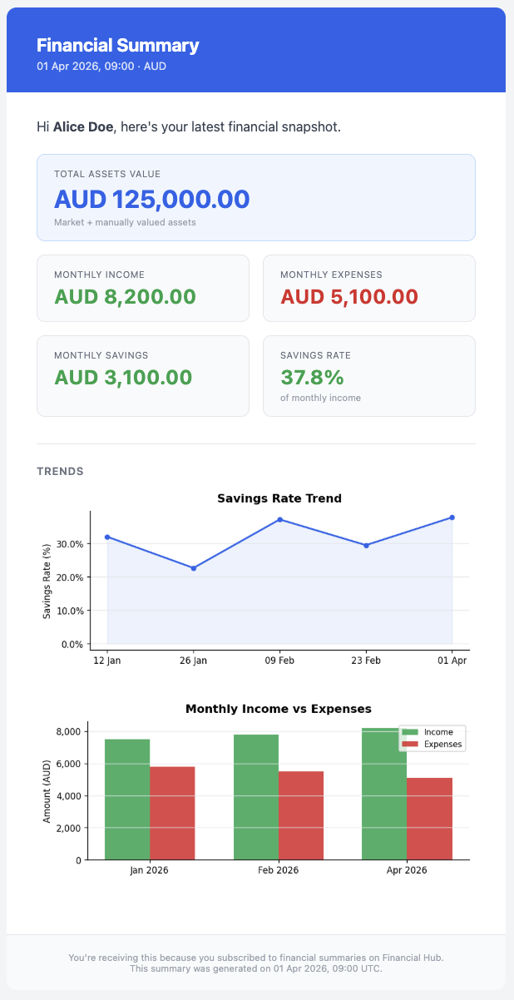

# financial-summary-worker 🐍


Async email notification worker built in **Python**. Consumes financial summary snapshots from RabbitMQ, generates trend charts, and delivers rich HTML emails to users.

This service is part of a larger financial portfolio system:
- ☕ **[Financial Profile API](https://github.com/emiisomoza/financial-profile-api)** — Java/Spring Boot: manages users, income, expenses and assets
- 💱 **[financial-price-api](https://github.com/emiisomoza/financial-price-api)** — Ruby/Sinatra: resolves real-time asset prices
- 🐍 **financial-summary-worker** (this repo) — Python: consumes a queue and sends summary emails

---

## Email preview



---

## Pipeline

```
RabbitMQ: summary.notifications
  → Pydantic validation     (security gate — malformed messages → DLQ)
  → SQLite insert            (persist snapshot for historical charts)
  → fetch history            (last 12 snapshots, same user + currency)
  → matplotlib charts        (savings rate trend + income vs. expenses)
  → Jinja2 HTML render       (auto-escaped, XSS-safe)
  → SMTP send                (STARTTLS enforced)
  → ACK
```

On any failure: NACK with `requeue=False` → `summary.notifications.dlq`.

---

## Tech stack

| | |
|---|---|
| Language | Python 3.12 |
| Queue | pika + RabbitMQ |
| Validation | Pydantic v2 |
| Persistence | SQLite (stdlib `sqlite3`) |
| Charts | matplotlib |
| Templates | Jinja2 |
| Email | smtplib (stdlib, STARTTLS) |
| Logging | structlog (structured JSON) |
| Testing | pytest + pytest-mock |
| CI | GitHub Actions |

---

## Design decisions

### Pydantic as the security gate
Every message from the queue is validated before any processing. If a field is missing, malformed, or the email address is invalid, the message is rejected to the DLQ before touching the database or mailer. `alias_generator=to_camel` maps the Java API's camelCase JSON fields to Python snake_case automatically.

### SQLite over a separate database
Zero infrastructure — no extra container needed. One record per user per week/month is well within SQLite's capabilities. History is always filtered by `(user_id, currency)`: if the user changes currency, the new currency starts fresh rather than mixing incomparable values in the same chart.

### Base64 chart embedding
Charts are embedded as base64 PNG strings in the email body. External image hosting was rejected because many email clients block external images by default, and URLs can expire. Trade-off: ~60KB of extra email size for two charts.

### Two charts, two strategies
- **Savings rate (line chart)** — raw history points. Weekly granularity shows how the savings rate evolves as the user records transactions during the month.
- **Income vs. expenses (bar chart)** — collapsed to one point per calendar month (`_last_per_month`). Income and expenses are monthly aggregates regardless of subscription frequency; plotting 4 near-identical weekly bars for January adds noise, not insight.

### ACK discipline
The message is ACKed **only after** the email is sent. A crash before the ACK causes the email to be sent twice — acceptable versus silent message loss. Any failure NACKs with `requeue=False` to avoid infinite retry loops on persistently broken messages.

### stdlib over third-party for email
`smtplib` works with any SMTP provider (Mailtrap, Gmail, Resend) by changing environment variables only. No library lock-in. STARTTLS is always enforced — no plaintext fallback.

### `main.py` separated from `consumer.py`
Tests import `consumer` and `repository` directly without triggering RabbitMQ connections or `.env` loading. If setup logic lived in `consumer.py`, any import would attempt a broker connection.

---

## Project structure

```
financial-summary-worker/
├── .github/
│   └── workflows/
│       └── ci.yml                    # GitHub Actions — runs pytest on every PR
├── src/worker/
│   ├── models.py                     # Pydantic SummaryMessage — first security gate
│   ├── repository.py                 # SQLite: insert snapshot + get_history
│   ├── charts.py                     # matplotlib: base64 PNG chart generation
│   ├── renderer.py                   # Jinja2: HTML email rendering
│   ├── mailer.py                     # smtplib: STARTTLS email send
│   ├── consumer.py                   # RabbitMQ pipeline orchestration
│   └── main.py                       # Entry point: env, logging, DB init, consumer
├── templates/
│   └── summary_email.html            # Jinja2 email template (mobile-responsive)
├── tests/
│   ├── test_models.py                # Pydantic validation (security gate)
│   ├── test_repository.py            # SQLite insert + history queries
│   ├── test_charts.py                # Chart generation + monthly grouping
│   ├── test_renderer.py              # HTML rendering + XSS escaping
│   ├── test_consumer.py              # ACK/NACK pipeline logic
│   └── test_mailer.py                # SMTP calls + TLS enforcement
├── scripts/
│   └── publish_test_messages.py      # Local end-to-end testing
├── .env.example
├── Dockerfile
└── requirements.txt
```

---

## Run locally

### Prerequisites
- Python 3.12+
- Docker (for RabbitMQ)

### Setup
```bash
git clone https://github.com/emiisomoza/financial-summary-worker.git
cd financial-summary-worker

python3.12 -m venv .venv && source .venv/bin/activate
pip install -r requirements.txt

cp .env.example .env
# Edit .env with your RabbitMQ and SMTP credentials
```

### Start RabbitMQ
```bash
docker run -d --name rabbitmq -p 5672:5672 -p 15672:15672 rabbitmq:3-management
```

### Start the worker
```bash
PYTHONPATH=src python -m worker.main
```

### Publish test messages
```bash
python scripts/publish_test_messages.py            # mixed (default)
python scripts/publish_test_messages.py monthly    # 4 monthly snapshots
python scripts/publish_test_messages.py weekly     # 8 weekly snapshots
python scripts/publish_test_messages.py mixed      # 8 weekly + 2 monthly
```

---

## Run tests

```bash
PYTHONPATH=src python -m pytest tests/ -v
```

No external services needed — tests use in-memory SQLite and mock all I/O.

---

## Environment variables

| Variable | Default | Required | Description |
|----------|---------|----------|-------------|
| `RABBITMQ_HOST` | `localhost` | | RabbitMQ hostname |
| `RABBITMQ_PORT` | `5672` | | RabbitMQ AMQP port |
| `RABBITMQ_USERNAME` | `guest` | | RabbitMQ username |
| `RABBITMQ_PASSWORD` | | ✓ | RabbitMQ password |
| `SMTP_HOST` | | ✓ | SMTP server hostname |
| `SMTP_PORT` | `587` | | SMTP port |
| `SMTP_USER` | | ✓ | SMTP username |
| `SMTP_PASSWORD` | | ✓ | SMTP password |
| `EMAIL_FROM` | | ✓ | Sender address |
| `DB_PATH` | `./data/summaries.db` | | SQLite database path |
| `LOG_LEVEL` | `INFO` | | Logging level |

---

## Message schema

JSON published to `summary.notifications` by the Java API:

```json
{
  "userId": "uuid",
  "userEmail": "user@example.com",
  "userName": "Alice Doe",
  "totalAssetsValue": 125000.00,
  "monthlyIncome": 8000.00,
  "monthlyExpenses": 5500.00,
  "monthlySavings": 2500.00,
  "savingsRate": 0.3125,
  "unpricedAssetsCount": 0,
  "currency": "AUD",
  "generatedAt": "2026-04-01T09:00:00Z"
}
```

---

## Security

| Concern | Mitigation |
|---------|-----------|
| Malformed queue messages | Pydantic rejects before any processing → DLQ |
| HTML injection in email | Jinja2 `autoescape=True` |
| PII in logs | structlog redacts `user_email`, `user_name` |
| SMTP credentials | Environment variables only, never hardcoded |
| Plaintext email transport | STARTTLS enforced, no fallback |
| Container privilege | Non-root user (UID 1000) in Dockerfile |

---

## License

MIT
